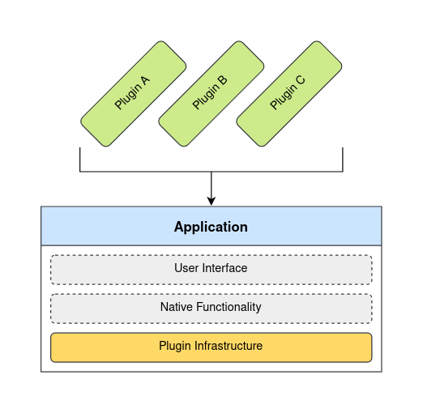
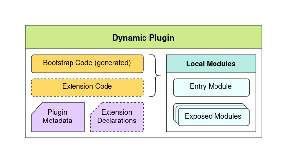

# Dynamic Plugins Overview

This document describes the concept of dynamic plugins without going into the underlying technical
details.

## Dynamic Plugin

Plugins are software components used to extend functionality of an existing program or application.
Dynamic plugins are plugins which can be loaded from remote sources over the network dynamically at
runtime.

Dynamic plugins can be loaded at any point during the application runtime. A common pattern is to
collect information on all dynamic plugins for the given application and start loading them as soon
as the application starts up.



The main benefit of dynamic plugins is the ability to develop, build, release and deploy such plugins
independently from the given application. This allows different teams to work on different parts of
the application's functionality without being constrained to a single product code base and release
cycle.

## Host Application

Applications capable of loading and interpreting dynamic plugins are referred to as host applications.
These are typically web applications providing a user interface that can be extended through plugins.

Host applications typically fall under two categories: micro frontends and extensible monoliths.

Micro frontends are applications providing the minimum necessary infrastructure and user interface to
support loading and interpreting dynamic plugins. The actual functionality provided by the application
at runtime comes exclusively from its plugins.

Extensible monoliths provide native functionality while also supporting runtime extensibility through
plugins. Different monoliths may support different degrees of extensibility.

## Module Federation

When host applications are built, their code is organized into local modules. All local modules put
together comprise the functionality of the given application.


From host application perspective, any code contributed by plugins is organized into remote modules.
All remote modules put together comprise the functionality of the given plugin.



To invoke code contributed by a plugin, an application first loads the plugin's remote entry module.
Through the entry module, specific modules exposed by the plugin can be loaded on demand when needed.

## Shared Modules

Host applications may share common modules with their plugins. For example, a React web application
may provide a single shared `react` module to its plugins.

When an application starts up, it creates a shared scope object containing any application provided
shared modules. This shared scope object is then used to initialize all plugins loaded by the given
application. Plugins may provide additional shared modules by extending the shared scope object.

## Extensions

Each extension represents a single instance of extending functionality of the target application(s).

Extensions are declarative and typically expressed as plain static objects.

```js
// Example extension declaration that would add a new
// navigation link to the application's user interface.
{
  type: 'app.navigation/link',
  properties: {
    text: 'Visit Foo page',
    url: '/pages/foo',
  }
}
```

Extension type determines the kind of extension to perform, while any data and/or code necessary
to interpret such extensions are declared through their properties.

Extensions may contain code references pointing to specific modules exposed by the plugin.

```js
// Example extension declaration that would register
// a new route containing the provided visual component.
{
  type: 'app.content/route',
  properties: {
    path: '/pages/foo',
    component: { $codeRef: 'FooPageModule' },
  }
}
```

Different host applications may support different extension types.
